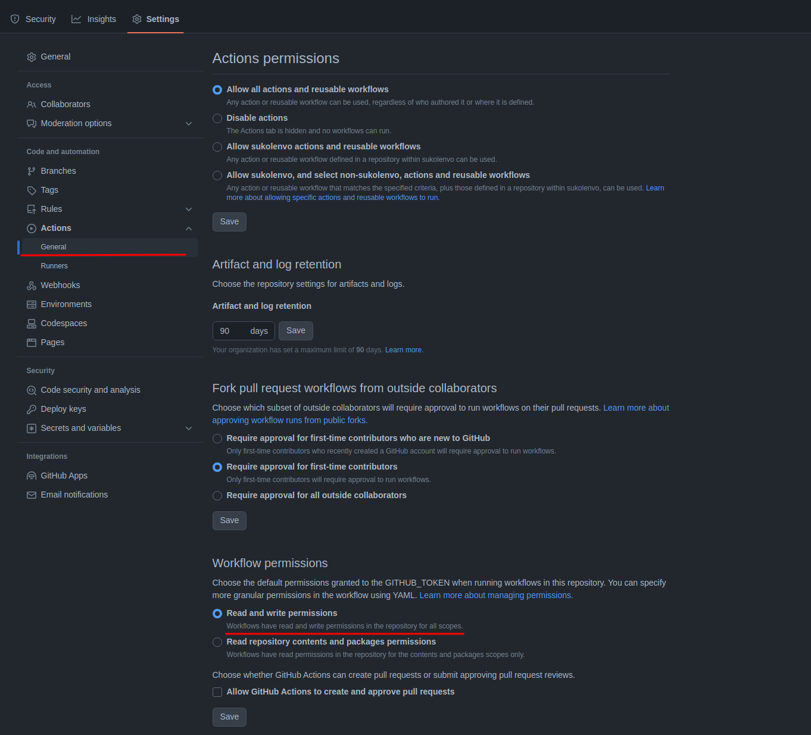

### Code Coverage Notes

* store repo code coverage in [git-notes](https://git-scm.com/docs/git-notes).
* update PRs with coverage diff, eg:
    ```diff
    @@ Coverage info. Don't edit past this section @@
    + instruction: 60% (+1)
    + line: 61% (+1)
    class: 78%
    + branch: 44% (+1)
    + method: 67% (+2)
    + complexity: 57% (+1)
  ```
* Java (jacoco) and GCC (cobertura) reports supported

#### Integration

1. Enable actions to push notes to the repo in settings: 
2. Add action for PR open/reopen events, example: https://github.com/sukolenvo/simple-cpp-github-rest/blob/master/.github/workflows/coverage-notes-pr.yml
3. Update CI action that runs tests & code coverage on push event ([example](https://github.com/sukolenvo/simple-cpp-github-rest/blob/4c1d678c2f67b2d618ecbefc145d76a7f49a1ae3/.github/workflows/linux.yml#L55)):
    ```yaml
       - name: coverage-note
         uses: sukolenvo/coverage-notes-action@v0.4.3
         if: ${{ matrix.compiler.gcovExecutable != '' && matrix.build-type == 'Debug' }}
         continue-on-error: true
         with:
           repo_token: ${{ secrets.GITHUB_TOKEN }}
           cobertura: build/coverage.xml
    ```
